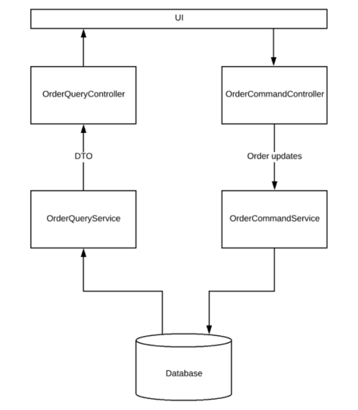

# Getting Started
Source of documentation: https://www.vinsguru.com/cqrs-pattern/

### Overview
This project try to show how implement a simple CQRS Pattern with Spring Boot.
where we manage read and write workloads in dedicated ways.

Instead of having 1 single interface which is responsible for all the READ and WRITE operations:


We have dedicated controllers for Query (READ) and Command (WRITE):


## 
We can even control if the app should work in READ mode or WRITE mode based on a property value. 
We should change the following property: 
```properties
app.write.enabled=true
```
## CQRS Pattern – Scaling:
Now we have successfully split the READ and WRITE models. Now we should have the ability to scale our system independently.

On the Query and Command controllers, we have a condition for Spring Boot whether to create this controller or not. 
That is, below annotation will help creating the controller only if the *app.write.enabled* is set to true. 
Otherwise, It would not create this controller bean.

```java
//for WRITE controller
@ConditionalOnProperty(name = "app.write.enabled", havingValue = "true")
```

If the value is set to false, It will create this controller.
```java
//for READ controller
@ConditionalOnProperty(name = "app.write.enabled", havingValue = "false")
```

So based on a property, we change if the app is going to behave like a read-only node or write-only node. 
It gives us the ability to run multiple instances of an app with different modes. I can have 1 instance of my app 
which does the writing while I can have multiple instances of my app just for serving the read requests. 
They can be scaled in-out independently.